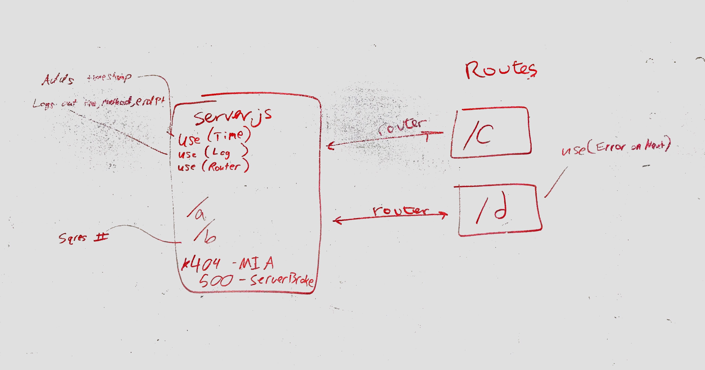

# LAB - 07

## api-server

### Author: Brad Smialek

### Links and Resources
* [Link to lab-7-middleware repo](https://github.com/brad-smialek-401-advanced-javascript/lab-07-middleware)
* [submission PR](https://github.com/brad-smialek-401-advanced-javascript/lab-07-api-server/pull/1)
* [travis]()

### Modules
#### `index.js`
#### `server.js`

### Setup
* `PORT` - 3000

#### Running the app
* `nodemon`

* `http://localhost:3000/?path`

* `echo '{"id": number, "description":"string","display_name": "string", "string":"text"}' | http post :3000/categories`
  * creates a record with schema variable
  
#### REST Methods
* `get '/categories'`
  * Returns a JSON object with count and results.
* `get '/categories/:id'`
  * Returns a record.
* `post '/categories'`
  * creates a new record.
* `delete '/categories/:id'`
  * deletes a record by id.
* `put '/categories/:id'`
  * updates a record by id.
* `use '*'`
  * Returns a 404 error
* `use 'error'`
  * Returns a 500 error

#### Documentation
* [swagger](./docs/config)
* [jsdoc](http://localhost:3000/docs)

#### Tests
* npm test server.test.js
* bad routes or methods expect error

#### UML

